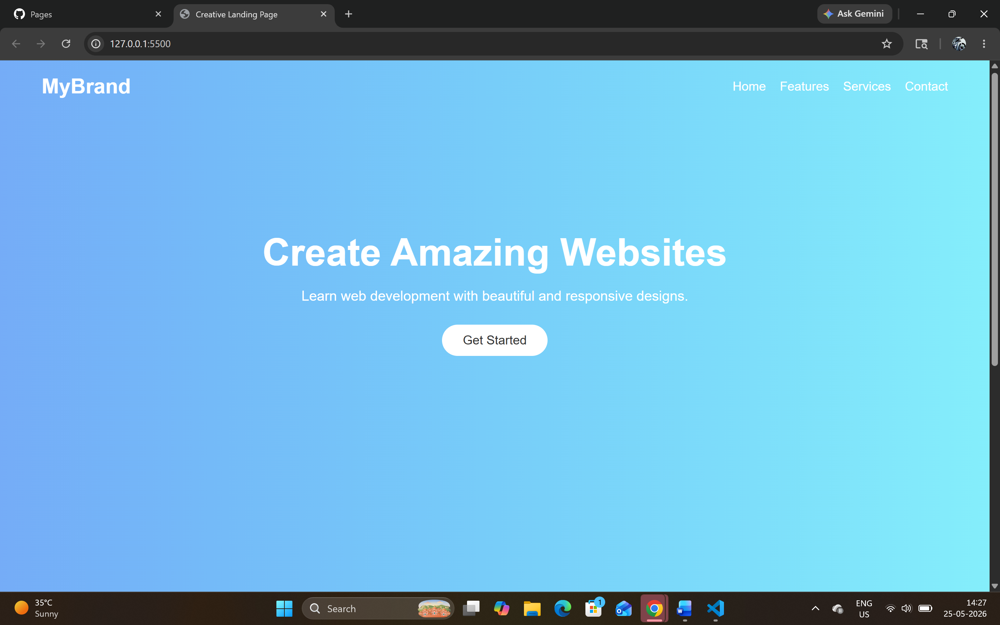

# 🌐 Landing Page Project

A simple and responsive landing page created using HTML and CSS.  
This project is designed to provide an attractive user interface and smooth user experience.


## 📌 Features

✨ Responsive Design  
✨ Clean UI Layout  
✨ Easy Navigation  
✨ Attractive Background & Styling  
✨ Beginner Friendly Project  


## 🛠️ Technologies Used

- 🧱 HTML5
- 🎨 CSS3


## 📂 Project Structure

```
project-folder/
│
├── index.html
├── style.css
└── README.md
```


## 🚀 How to Run

1. Download or clone the repository: https://cherlasindhura29.github.io/OIBSIP_WEBDEV_TASK1/

2. Open the project folder
3. Open `index.html` in browser


## 📷 Project Preview




## 🎯 Purpose

This project was created for practice and learning frontend web development concepts.


## 📬 Contact

GitHub: your-github-username


⭐ If you like this project, give it a star!

## Author
Sindhura Cherla